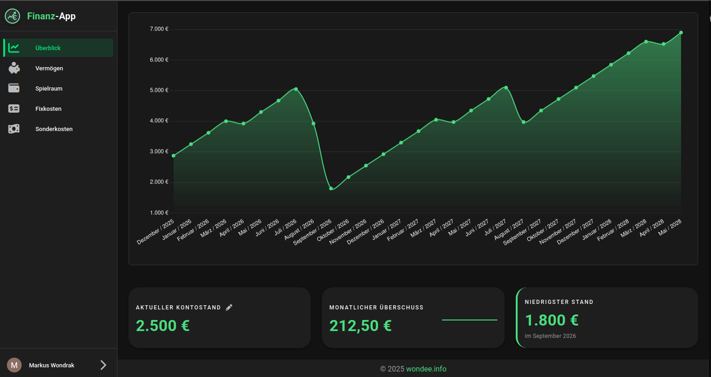

# Finance App

[](https://github.com/markuswondrak/finance-app/actions/workflows/ci-cd.yml)

A modern personal finance tracking application built with Vue.js 3 and Go. It helps users manage fixed costs, track special expenses, manage wealth accumulation, and visualize financial forecasts with a fintech-inspired dark theme.



Try it out here: https://finance.wondee.info/

## Features

- **Fintech Dashboard:** High-level overview of current balance, monthly surplus, and risk indicators.
- **Fixed Costs Management:** Track recurring expenses (monthly, quarterly, half-yearly, yearly).
- **Special Costs Tracking:** Manage one-time or irregular expenses.
- **Wealth Management:** Track assets, configure wealth profiles, and forecast long-term accumulation.
- **Save-to-Spend:** Monthly budgeting feature that tracks pending costs against available balance.
- **Financial Forecasting:** Visual sparklines and charts for surplus trends and balance projections.
- **Workspace Collaboration:** Multi-user workspaces with invite system for shared financial planning.
- **User Onboarding:** Guided setup wizard for new users.
- **Google Authentication:** Secure login using Google OAuth2.
- **Dark Theme:** Modern, high-contrast UI designed for readability.
- **Responsive Design:** Optimized for various screen sizes using Vuetify 3.

## Setup Guide

### Prerequisites

- **Frontend:** Node.js (v20+) and `pnpm` (v9+).
- **Backend:** Go (v1.24+) and Podman (or Docker) for the database.

### Database Setup

1. Navigate to the backend database directory:
   ```bash
   cd backend/db
   ```
2. Start the PostgreSQL container:
   ```bash
   ./start-db.sh
   ```
   *Note: This script uses Podman to run a PostgreSQL 17 instance.*

### Backend Setup

1. Navigate to the backend directory:
   ```bash
   cd backend
   ```
2. Install dependencies:
   ```bash
   go mod download
   ```
3. Run the server:
   ```bash
   go run cmd/server/main.go
   ```
   *The backend will be available at `http://localhost:8082`.*

### Frontend Setup

1. Navigate to the frontend directory:
   ```bash
   cd frontend
   ```
2. Install dependencies:
   ```bash
   pnpm install
   ```
3. Start the development server:
   ```bash
   pnpm dev
   ```
   *The frontend will be available at `http://localhost:8080`.*

## Folder Description

- **`frontend/`**: Vue.js 3 application using Vuetify 3, Vite, and Vitest.
  - `src/components/`: Page-centric folder structure (e.g., `wealth/`, `overview/`, `spend/`) containing views and their specific sub-components, plus `common/` for shared UI elements.
  - `src/services/`: API client and communication logic.
  - `src/composables/`: Vue composables for shared stateful logic.
- **`backend/`**: Go REST API using the Gin framework and GORM with domain-oriented architecture.
  - `cmd/server/`: Entry point for the Go application.
  - `internal/api/`: Server wiring and central orchestration.
  - `internal/auth/`: Authentication domain (JWT, middleware).
  - `internal/user/`: User domain (handlers, services, models).
  - `internal/workspace/`: Workspace and collaboration domain (invites, email).
  - `internal/cost/`: Cost management domain (fixed costs, special costs).
  - `internal/spend/`: Save-to-Spend domain (monthly payment tracking).
  - `internal/wealth/`: Wealth management domain (profiles, forecasting).
  - `internal/overview/`: Dashboard/statistics domain.
  - `internal/platform/`: Shared infrastructure (types, database config).
  - `internal/storage/`: Repository implementations (GORM).
  - `db/`: Database initialization scripts and container setup.
- **`specs/`**: Feature specification folder with documentation, design plans, and task lists.
- **`.specify/`**: Speckit configuration and project memory (constitution, templates).
- **`.github/workflows/`**: CI/CD pipelines for automated testing and deployment.
- **`deploy/`**: Terraform infrastructure-as-code for GCP deployment.
